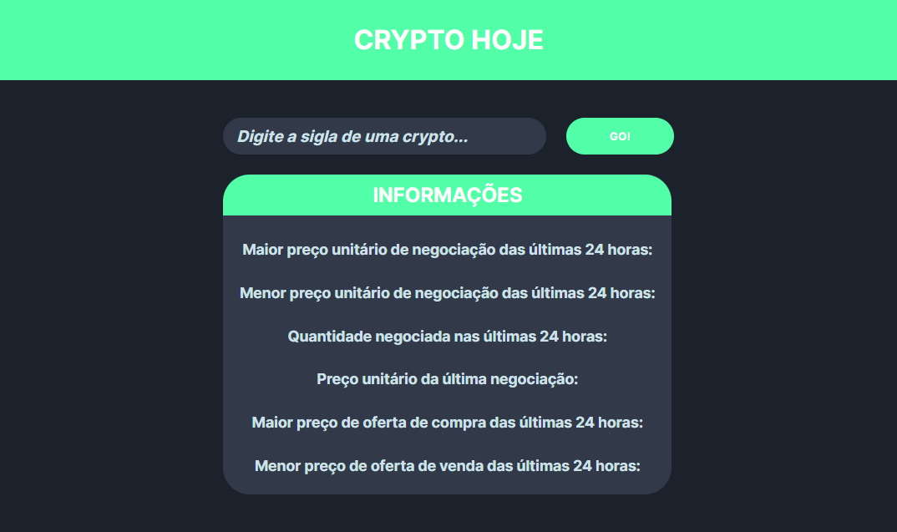

# Crypto Hoje

Aplicação criada para consultar diversas informações de determinada cryptomoeda utilizando a API [Mercado BitCoin](https://www.mercadobitcoin.com.br/api-doc/#estrutura-das-requisições)

## Indice

- [Visão geral](#overview)
  - [Imagens](#screenshot)
  - [Links](#links)
- [Processo](#my-process)
  - [Tecnologias usadas](#built-with)
- [Author](#author)

## Overview

### Screenshots

#### Desktop

### Links

- Live Site: [GitHub Pages](https://bruno-oli.github.io/crypto-hoje/)

### Tecnologias usadas

- Semantic HTML5 markup
- CSS custom properties
- SASS/SCSS
- Flexbox
- JavaScript
- API Mercado BitCoin

## Author

- Frontend Mentor - [@bruno-oli](https://www.frontendmentor.io/profile/bruno-oli)
- Twitter - [@realsayden](https://www.twitter.com/realsayden)
- GitHub - [@bruno-oli](https://github.com/bruno-oli)
- Instagram - [@bruno.sayden](https://www.instagram.com/bruno.sayden/)
